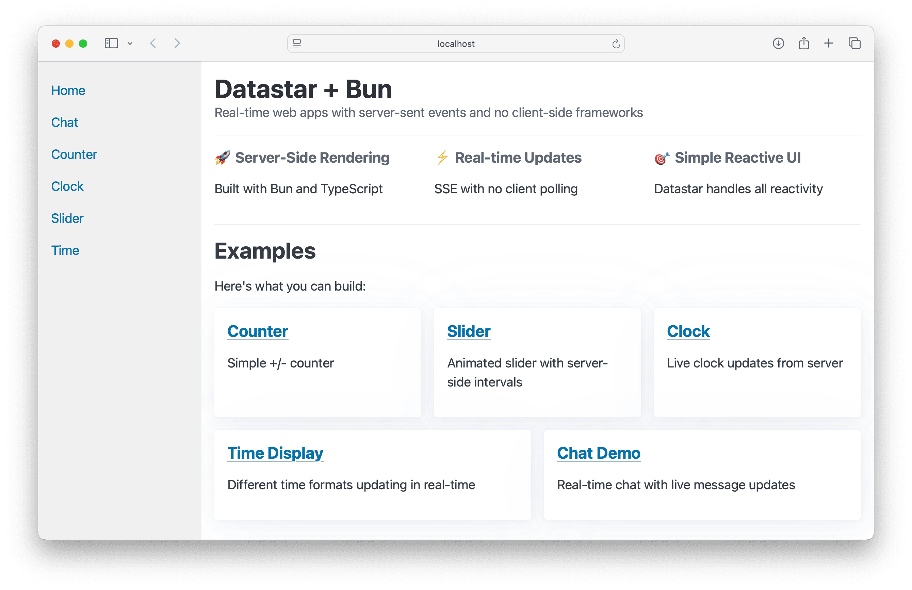

# Datastar + Bun Examples

Examples of using [Datastar](https://github.com/starfederation/datastar) with [Bun](https://bun.sh/) for real-time server-sent events.



### Simple case

```typescript
"/sse/time": sse(async function* () {
    yield patchElements(<div>{new Date().toISOString()}</div>);
})
```

### With polling:

```typescript
"/sse/chat": sse(async function* () {
    for await (const _ of interval(1000)) {
        const msg = `Ping ${new Date().toLocaleTimeString()}`;
        yield patchElements(<li>{msg}</li>, { selector: "#chat", mode: "append" });
        yield patchSignals({ lastMsg: msg });
    }
})
```

### With request/signals:

```typescript
"/sse/updates": sse(async function* (req, signals) {
    // Initial state
    yield patchSignals({ loading: true });
    
    // Check for updates every 2 seconds
    for await (const _ of interval(2000)) {
        const updates = await checkForUpdates(signals.lastId);
        if (updates.length > 0) {
            for (const update of updates) {
                yield patchElements(<li>{update.text}</li>, { selector: "#updates", mode: "append" });
            }
            yield patchSignals({ lastId: updates.at(-1).id, loading: false });
        }
    }
})
```

## Getting Started

```bash
# Install dependencies
bun install

# Start the development server
bun dev
```

Server runs on `http://localhost:5555`

## Examples

- **Welcome** (`/`) - Homepage
- **Counter** (`/counter`) - Simple counter with buttons
- **Chat** (`/chat`) - Real-time chat with SSE
- **Clock** (`/clock`) - Live updating clock
- **Slider** (`/slider`) - Interactive slider
- **Time** (`/time`) - Time display with different formats

### Project Structure

```
src/
├── server.ts         # Main server with Bun.serve() and consolidated routes
├── components/       # Reusable React components
│   └── shell.tsx     # App shell with navigation
├── lib/              # Core utilities
│   ├── datastar.ts   # Datastar expression helpers
│   └── sse.ts        # Server-Sent Events utilities
└── pages/            # Individual examples
    ├── chat.tsx      # Real-time chat
    ├── clock.tsx     # Live clock
    ├── counter.tsx   # Interactive counter
    ├── slider.tsx    # Range slider
    ├── time.tsx      # Time formatting
    └── welcome.tsx   # Welcome page
```

## Key Features

### Server-Side Intervals

The `interval()` function handles timing on the server:

```ts
"/sse/clock": sse(async function* (req: Request, signals: Signals) {
    yield patchSignals({ time: new Date().toISOString() });
    for await (const _ of interval(1000)) {
        yield patchSignals({ time: new Date().toISOString() });
    }
}),
```

### SSE Utilities

The `src/lib/sse.ts` module has everything:

- **`interval(ms)`** - Server-side timing
- **`patchElements(html, {selector, mode})`** - Update DOM elements
- **`patchSignals(signals)`** - Update reactive state
- **`readSignals(req)`** - Get signals from requests
- **`sse(async function* (req, signals) { ... })`** - Create SSE streams

### Datastar Integration

- **Reactive Data Binding** - `data-signals` for state
- **Event Handling** - `data-on-click`, `data-on-input`, etc.
- **Real-time Updates** - Server-Sent Events for live data
- **DOM Manipulation** - Server-driven element updates
- **Expression Language** - Datastar's reactive expressions

### Server Architecture

Built with `Bun.serve()` and consolidated routing:

```ts
serve({
    port: 5555,
    development: { hmr: true, console: true },
    routes: {
        ...Welcome.routes,
        ...Chat.routes,
        ...Clock.routes,
        ...Counter.routes,
        ...Slider.routes,
        ...Time.routes,
        "/public/*": (req) => new Response(Bun.file(`public/${path}`)),
    },
    fetch() { return new Response("Not found", { status: 404 }); },
});
```

## Example Usage

### Simple Counter

```tsx
export const routes = {
    "/counter": () => html(
        <div {...$({ counter: 0 })}>
            <button {...{ "data-on-click": $`$counter -= 1` }}>-</button>
            <h2 {...{ "data-text": $`$counter` }} />
            <button {...{ "data-on-click": $`$counter += 1` }}>+</button>
        </div>
    ),
};
```

### Real-time Clock

```tsx
export const routes = {
    "/clock": () => html(
        <Shell>
            <h2 {...{
                "data-text": $`$clock`,
                "data-on-load": "@get('/sse/clock')",
            }}>Loading...</h2>
        </Shell>
    ),
    "/sse/clock": sse(async function* (req: Request, signals: Signals) {
        yield patchSignals({ clock: new Date().toLocaleTimeString() });
        for await (const _ of interval(1000)) {
            yield patchSignals({ clock: new Date().toLocaleTimeString() });
        }
    }),
};
```

### Chat

```tsx
export const routes = {
    "/chat": () => html(/* chat interface */),
    "/sse/chat": sse(async function* (req: Request, signals: Signals) {
        yield patchElements(<li>Chat starting...</li>, { selector: "#chat", mode: "prepend" });
        for await (const _ of interval(1000)) {
            const msg = `Ping ${new Date().toLocaleTimeString()}`;
            yield patchElements(`<li>${msg}</li>`, { selector: "#chat", mode: "append" });
            yield patchSignals({ lastMsg: msg });
        }
    }),
};
```